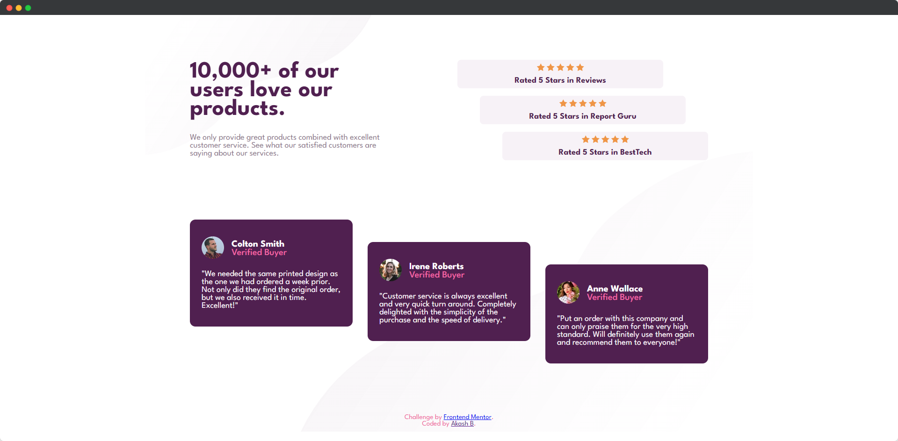
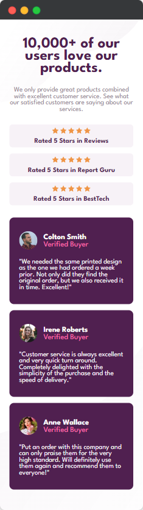

# Social proof section solution

This is a solution to the [Social proof section challenge on Frontend Mentor](https://www.frontendmentor.io/challenges/social-proof-section-6e0qTv_bA).

## Table of contents

- [Social proof section solution](#social-proof-section-solution)
  - [Table of contents](#table-of-contents)
    - [The challenge](#the-challenge)
    - [Screenshot](#screenshot)
    - [Links](#links)
    - [Built with](#built-with)
  - [Author](#author)

### The challenge

Users should be able to:

- View the optimal layout for the section depending on their device's screen size

### Screenshot

**Desktop**

**Mobile**

### Links

- Solution URL: [Solution URL](https://your-solution-url.com)
- Live Site URL: [Live site URL](https://your-live-site-url.com)

### Built with

- Semantic HTML5 markup
- CSS custom properties
- Flexbox
- Mobile-first workflow

## Author

- Website - [Akash B.](https://akashbanchhor.netlify.app)
- Frontend Mentor - [@akash02ab](https://www.frontendmentor.io/profile/akash02ab)